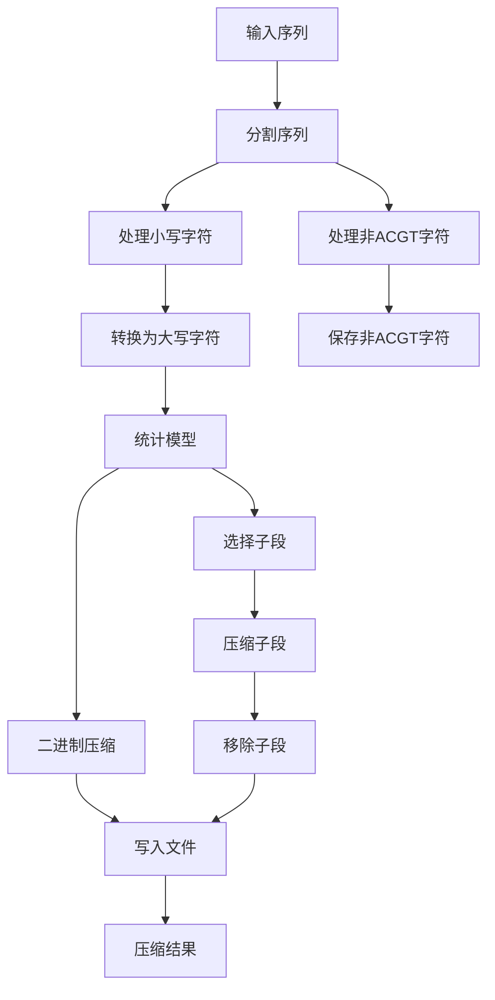

# SeqCompress生物序列压缩算法的python实现

## 项目目的

随着下一代测序技术的发展，生物序列数据的生成量呈指数级增长，这对于生物信息学研究者来说是一项巨大的挑战。特别是在设计能够高效处理大量数据的生物信息学工具方面，更是如此。另外，由于DNA测序速度的增加超过了磁盘存储容量的增长速度，生物序列数据存储成本已经成为整个过程中的一大瓶颈。因此，开发能够处理大数据集的算法，通过更好的内存管理来处理这些数据集，变得至关重要。

目前已经有各种方法用于DNA序列的压缩。压缩在处理不断增长的测序数据大小方面扮演着重要的角色。由于DNA序列可以自然地表示为一个字符字符串，因此可以使用通用的压缩方法进行压缩。对于这种压缩方法的表示形式，已经有丰富的文献支持。但是，基因组的本质是冗余的，因为同一物种的个体之间共享大部分基因组。因此，DNA序列的压缩可以利用某些生物特性，例如重复内容和与已有序列的关系。

本文使用python实现了一种名为SeqCompress的生物序列压缩算法，它通过统计模型和算术编码来处理DNA序列，项目文件见https://github.com/pursuingz/bio2502。
该算法基于统计模型，用于找到在给定序列中具有更好压缩比的子段，并决定是否使用基于子段的压缩或二进制压缩。算法通过将序列字符以二进制编码的形式写入文件来进行压缩。实验结果表明，该算法具有好的压缩效果。

##  算法原理

SeqCompress的实现原理如下：

1. 预处理：将输入序列分为两个段落，一个是fasta文件的头部，另一个是序列字符。算法将头部信息写入一个单独的文件，并保存多个头部在输入序列中的位置（如果存在多个头部）。序列字符段可能包含非ACGT或小写字符。算法会保存这些字符及其在序列中的位置，并将非ACGT字符从段落中删除，使得段落只包含大写的四个DNA碱基。

2. 统计模型：将第一阶段得到的序列作为输入，统计模型搜索长度为n的子段在输入序列中的频率f。模型重复m次，从而选择出m个最频繁的子段。根据子段的压缩比（PCR）来决定是否使用基于子段的压缩或二进制压缩。PCR的计算公式如下：
   - $PCR = \text{压缩后数据大小 }/ \text{压缩前数据大小} \times 100$
   - $PCR_s = f \times 8 + n \times 8 / (f \times n \times 8) \times 100$
   - $PCR_b = f \times n \times 2 / (f \times n \times 8) \times 100$
     如果子段 s 的 $PCR_s$ 比 $PCR_b$ 更好，则继续使用基于子段的压缩，否则选择下一个子段并重复该过程。为了减少执行时间，m和n的值被设置为较小的值，例如m = 6，n = 8。

3. 压缩：将第二阶段得到的序列分为多个子段，并使用统计模型和算术编码对这些子段进行压缩。将子段和子段在输入序列中的位置的差值以8位的形式保存。子段只保存一次，每个字符占用8位。对于剩余的碱基，使用2位的二进制编码进行压缩。

4. 压缩结果：将所有生成的文件使用7z等压缩工具进行压缩。

通过以上步骤，SeqCompress能够有效地压缩生物序列，并在压缩比方面表现出色。下面是SeqCompress算法的流程图。

## 实验

本文使用python代码实现算法的思路是：

1. 读取文件，将内容首尾相连连接为一个字符串

2. 将头的头和位置写入一个单独的文件，**分离**头信息

3. 搜索小写字符，保存小写字符块的开始和结束位置，写入一个单独的文件

4. 搜索非ACGT字符，保存非ACGT字符块的开始位置和内容，写入一个单独的文件，**分离**非ACGT字符

5. 根据论文中的统计模型找出重复子段。

6. 搜索重复字段，保存重复字段的开始位置，写入一个单独的文件，**分离**重复字段

7. 将剩下的内容进行二进制编码，方式为：A：00  T：01  C：10  G:11

8. 将所有文件运用7z进行压缩

为了让用户在测试时能更快得到序列压缩结果，本文在实验中选取了Candidatus Pelagibacter ubique的全基因组序列fasta文件进行测试。Candidatus Pelagibacter ubique（又称SAR11）是一种极小的自由生活海洋细菌，是海洋浮游微生物群落中的重要成员之一。该微生物细胞的大小约为0.12微米，其基因组只有大约1.3百万碱基对，是目前已知的世界上基因组最小的生物之一。

运行demo程序后就实现了对SAR11的基因组序列的压缩，总运行时长12秒，速度较快，且压缩包大小是原文件直接压缩包的三分之一。获得了`seqcompress.7z`的压缩包，将其解压后得到一个`base`文件夹，里面有五个文本文件：Heads_file.txt，Lowercase_file.txt，Non_ATCG_file.txt，Substring_file.txt ，main_file.txt。

Heads_file.txt存储了头信息，即每一行为：位置（去除所有头信息之后，原头信息后的第一个字母所处的位置）+空格+头信息+换行符。Lowercase_file.txt存储了含小写字母的子串的首尾字符的位置，即每一行为：首字母位置（去除所有头信息之后）+空格+尾字母位置（去除所有头信息之后）+换行符。Non_ATCG_file.txt存储了非ACGT字符块，即每一行为：位置（去除所有头信息以及非ACGT字符块之后，原非ACGT字符块后的第一个字母所处的位置）+空格+非ACGT字符块+换行符。Substring_file.txt存储了重复字段，即每一行为：重复子串内容+空格+重复子串位置（去除所有头信息、非ACGT字符块以及重复子串之后，原重复子串后的第一个字母所处的位置）+空格+位置+空格+位置+空格+......+换行符。main_file.txt则存储最终的二进制代码，即内容为：所有处理完成之后的二进制代码。文件具体的内容可在运行项目文件中的demo后得到，此处不做展示。

## 总结

文章的结论是，SeqCompress是一种基于统计模型和算术编码的DNA序列压缩算法。该算法能够处理重复和非重复序列，并通过预处理使输入文件更适合进行压缩。实验结果表明，SeqCompress比直接压缩具有更好的压缩效果。尽管SeqCompress的压缩和解压缩时间较长，但它在空间节省方面表现出色。因此，SeqCompress是一种有效的DNA序列压缩算法。

## 展望

该算法还存在以下可改进的地方：

1. 执行时间：SeqCompress的压缩和解压缩时间较长。可以进一步优化算法以提高执行效率，减少处理时间。
2. 参数设置：为了减少执行时间，SeqCompress选择了较小的子段数量和长度。可以进一步研究和优化这些参数的选择，以获得更好的压缩效果和更高的执行效率。
3. 处理非ACGT字符：目前的算法将非ACGT字符保存到单独的文件中，并从序列中删除这些字符。可以考虑其他方法来处理这些字符，以提高压缩效果。
4. 处理非重复序列：SeqCompress在处理重复序列方面表现良好，但对于非重复序列的压缩效果可能有限。可以研究和改进算法，以更好地处理非重复序列，提高压缩效果。
5. 算法适用性：该算法在处理DNA序列时表现出色，但对于其他类型的生物序列，如蛋白质序列，可能需要进行适当的修改和调整。
6. 内存管理：由于SeqCompress处理大规模数据集时需要存储大量的中间结果，因此可以进一步优化内存管理，减少内存占用，提高算法的效率和可扩展性。
7. 压缩率：尽管SeqCompress在压缩方面表现出色，但仍有改进的空间。可以进一步研究和优化统计模型和算术编码的方法，以提高压缩率，减少压缩后的文件大小。

综上所述，SeqCompress算法可以在执行时间、参数设置、处理非ACGT字符和算法适用性等方面进行改进。

